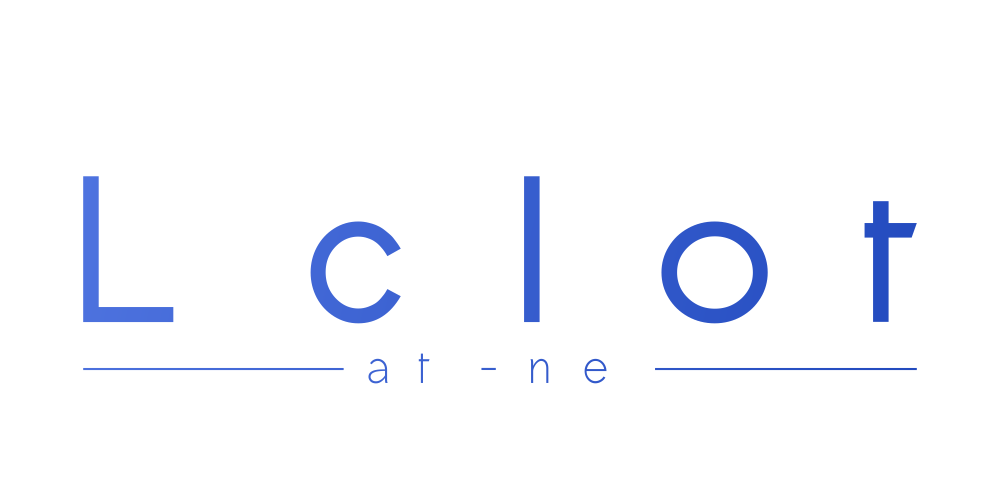

## About Localhost-index

This is a smart auto-index for your localhost.

### Require
- Apache
- PHP
- MySql
- Web Browser

### TO DO
- [ ] Listar arquivos recursivamente
- [ ] Listagem em ordem alfabética
- [ ] Melhorar o README.md
- [ ] Melhorar link ativo no menu (nav)
- [ ] Mostrar quando algum componente for atualizado
- [ ] Seleção de idioma
- [ ] Login com GitHub (pegar a foto de perfil)

## Contributing

Contributions are what make the open source community such an amazing place to be learn, inspire, and create. Any contributions you make are **greatly appreciated**.

1. Fork the Project
2. Create your Feature Branch (`git checkout -b feature/AmazingFeature`)
3. Commit your Changes (`git commit -m 'Add some AmazingFeature'`)
4. Push to the Branch (`git push origin feature/AmazingFeature`)
5. Open a Pull Request

## Contact

- Email: tiagolucas9830@gmail.com
- GitHub: [@tiagoFlach](https://github.com/tiagoFlach)
- Instagram: [@flachtiago](https://instagram.com/flachtiago)
- LinkedIn: [Tiago Lucas Flach](https://linkedin.com/in/tiago-lucas-flach-585033121/)

- Project link: [http://github.com/tiagoFlach/localhost-index](https://github.com/tiagoFlach/localhost-index)

## License

Distributed under the [MIT license](https://mit-license.org/).  
Copyright 2020 © [tiagoFlach](https://github.com/tiagoFlach).
